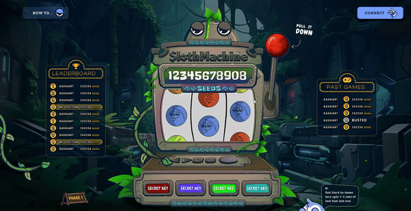

# Sloth Machine Idea "realisation"

A sort mood test for the sloth machine to see how I could play around with different elements and the like.

## Motivation

I saw a project on Upwork and decided to try and use the designs to fake some interactions.

## What's been done?

Well, for starters, not much. I only worked on this for about 2 hours, and most of the time I spent just trying to get the images and SVG paths to play nice.

Using AI and GIMP, I was able to remove pieces of the foreground in different designs to create different sections. Of course, this isn't how I'd make a slot game, this would be best done in Phaser 3, but I was wondering how far I could take it in 2 hours.

## Will you improve on this?

No, I wanted to add reel spinning, but when I started hearing voices telling me to make the eyes blink I realised I'd gone too deep down the rabbit hole. So, I backed away, wrote this README file and committed my changes.

No more, this is just a kinda joke test, so nothing too serious here.

## Run the project

I made this simple on purpose, so running it is a matter of just using this command `npx serve . -C -p 8080`